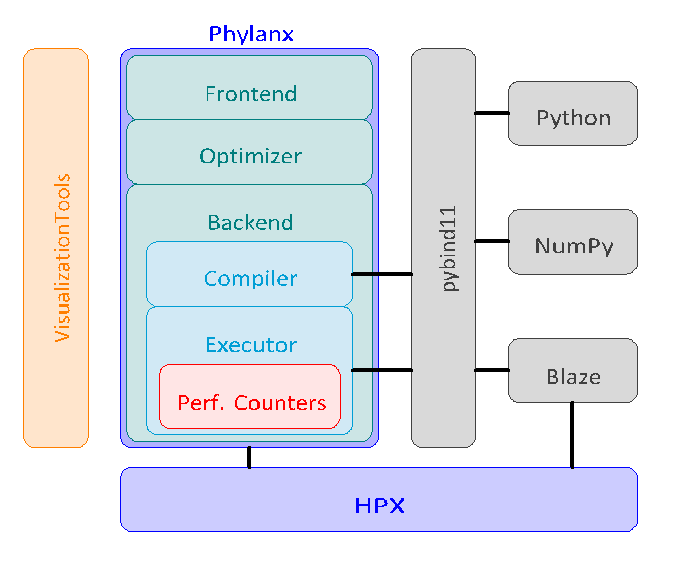

..
    Copyright (C) 2018 Mikael Simberg
    Copyright (C) 2019 Adrian Serio

    Distributed under the Boost Software License, Version 1.0. (See accompanying
    file LICENSE_1_0.txt or copy at http://www.boost.org/LICENSE_1_0.txt)

==============
Software Stack
==============

The |phylanx| framework is made up of several distinct 
layers as illustrated in Figure 1.

    Figure 1. Overview of the |phylanx| toolkit.

In this portion of the manual we discuss 
the external libraries |phylanx| depends on
and the layers of the software stack.

------------------
External Libraries
------------------

^^^^^^^
HPX
^^^^^^^
HPX is an asynchronous many-task runtime system capable of 
running scientific applications both on a single process as 
well as in a distributed setting on thousands of nodes. 
In this project, we use HPX as an execution engine 
which schedules tasks created by |phylanx| and 
manages the required task synchronization both 
locally and in a distributed setting. To learn more 
about HPX, please refer to the 
`HPX Documentation <https://stellar-group.github.io/hpx/docs/sphinx/branches/master/html/index.html>`_.

^^^^^^^
Blaze
^^^^^^^

Blaze is a high performance C++ math library which 
leverages meta-programing techniques to 
transform matrix arithmetic into highly efficient 
operations. More information about the library 
can be found on the 
`Blaze project page <https://bitbucket.org/blaze-lib/blaze/src/master/>`_

^^^^^^^
APEX
^^^^^^^

APEX is an introspection and runtime adaptation library 
which is developed in coordination with |phylanx|. 
The library supports tools such as TAU, PAPI, 
ActiveHarmony, and OTF2. In the |phylanx| project 
our team uses APEX as a platform to gather performance
information and use that information to drive 
a policy engine. To learn more about the project,
please refer to the 
`APEX repository <https://github.com/khuck/xpress-apex>`_

--------
Frontend
--------

The Phylanx frontend provides two essential functionalities:

* Transform the python code into a Phylanx internal representation called
  PhySL (Phylanx Specification Language).
* Copy-free handling of data objects between Python and Phylanx executor
  (in C++).

In addition, the frontend exposes two main functionalities of 
Phylanx that are implemented in C++ and required for 
generation and evaluation of the execution
tree in Python. These functions are the *compile* and
*eval* methods.

1. **Code Transformation** - Performance benefits of many-task 
runtime systems, 
like HPX, are more prominent when the compute loads 
of the system exceeds the available resources. Therefore,
using these runtimes for sections of a program which 
are not computationally intensive may result in little 
performance benefit. Moreover, the overhead of code 
transformation and inherent extraneous work
imposed by runtime systems may even cause performance 
degradation. Therefore, we have opted to limit our 
optimizations to performance critical parts of the code 
which we call computational *kernels*. The Phylanx frontend
provides a decorator *@Phylanx* to trigger transformation 
of kernels into the
execution tree.

We have developed a custom internal representation of Python AST in order to
facilitate the analysis of static optimizations and streamline the generation of the
execution tree. The human-readable version of the AST, aka PhySL, is
automatically generated and compiled into the execution tree by the frontend.
More details on this compilation process can be found in~\ref{subsec:exe_tree}.
The benefit of
using PhySL as the intermediate representation is twofold: (1) it closely
reflects the nodes of the execution tree as each PhySL node represents a
function that will be run by an HPX task during evaluation, and (2) it can be
used for debugging and analyzing purposes for developers interested in custom
optimizations.

The compiled kernel is cached and can be invoked directly in Python or in
other kernels.

2. **Data Management** - Phylanx's data structures rely on 
the high-performance open-source C++ library 
`Blaze <https://bitbucket.org/blaze-lib/blaze/src/master/>`_. 
Blaze already supports HPX as a parallelization 
library backend and it perfectly maps its data to Python data
structures. Each Python list is mapped to a C++ *vector* 
and 1-D and 2-D NumPy arrays are mapped to a 
Blaze vector and Blaze matrix respectively. To
avoid data copies between Python and C++, we 
take advantage of Python buffer protocol through 
the pybind11 library. Figure~\ref{fig:phylanxarch} shows how
Phylanx manages interactions with external libraries.

--------------
Execution Tree
--------------

After the transformation phase, the frontend passes 
the generated AST to the Phylanx compiler to construct 
the execution tree where nodes are *primitives* and 
edges represent dependencies between parents and
children pairs.

Primitives are the cornerstones of the Phylanx toolkit 
and building blocks of the Phylanx execution tree. 
Primitives are C++ objects which contain a single execute
function. This function is wrapped in a *dataflow* and can
be as simple as a single instruction or as complex as a 
sophisticated algorithm. We have implemented and 
optimized most Python constructs as well as many 
NumPy methods as primitives. Futurization and asynchronous 
execution of tasks are enabled through these constructs. 
One can consider primitives as lightweight tasks that 
are mapped to HPX threads. Each primitive accepts a 
list of futures as its arguments and returns the 
result of its wrapped function as a future.
In this way, the primitive can accept both constant 
values known at compile time as well as the results 
of previous primitives known only after being computed.

Upon the invocation of a kernel, Phylanx triggers 
the evaluation function of the root node. This node 
represents the primitive corresponding to the
result of the kernel. In the evaluation function, 
the root node will call the evaluation function of 
all of its children and those primitives will call the
evaluation functions of their children. This process 
will continue until the leaf nodes have been 
reached where the primitives evaluation functions
do not depend on other primitives to be resolved 
(e.g. a primitive which is a constant, a primitive 
which reads from a file, etc.). It is important to note
that it does not matter where each primitive is 
placed in a distributed system as HPX will resolve 
its location and properly call its eval function as well as
return the primitive's result to the caller.

As the leaf primitives are reached and their values, 
held in futures, are returned to their parents, 
the tree will unravel at the speed of the
critical path through the tree. The results from 
each primitive satisfy one of the inputs of its 
parent node. After the root primitive finishes 
its execution, the result of the entire tree 
is then ready to be consumed by the calling
function.

---------------
Instrumentation 
---------------

Application performance analysis is a critical part 
of developing a parallel application. Phylanx 
enables performance analysis by providing performance
counters to provide insight into its intrinsics. 
*Time* performance counters show the amount of 
time that is spent executing code in each subtree of
the execution tree, and *count* performance counters 
show how many times an execution tree node is 
executed. This data aides in identifying performance
hotspots and bottlenecks, which can either be 
directly used by the users or fed
into APEX for adaptive load balancing. The data can also
be used by the visualization tools described in the next section.

--------------------
Visualization Tools
--------------------

Embedding annotations and measurements for 
visualizations and performance
analysis within the runtime provides a
way to determine where performance bottlenecks 
are occurring and to gain insight 
into the resource management within the machines. 
In the tree produced by the tool, nodes are 
Phylanx primitives and edges show
parent/child relationships regarding how the 
child was called. The nodes are
colored purple for the *inclusive time*, the total 
time spent executing that primitive and its children. 
A switch provided in the toolbox 
allows for the user to switch from inclusive 
time to *exclusive time*, the time spent executing 
only that primitive. This allows for
identification of hotspots in the tree. Each primitive 
can be executed asynchronously or synchronously 
in the parent thread. This distinction is expressed
in dotted versus solid circles for nodes in the tree. 
The tree is interactive, allowing users to drill 
down and focus by expanding or collapsing tree nodes and
hover for more details. The visualization is linked 
with a code view showing the Python source code 
(the corresponding PhySL is shown as well). Hovering 
over a node or line in one will highlight the 
corresponding line or node in the other.
